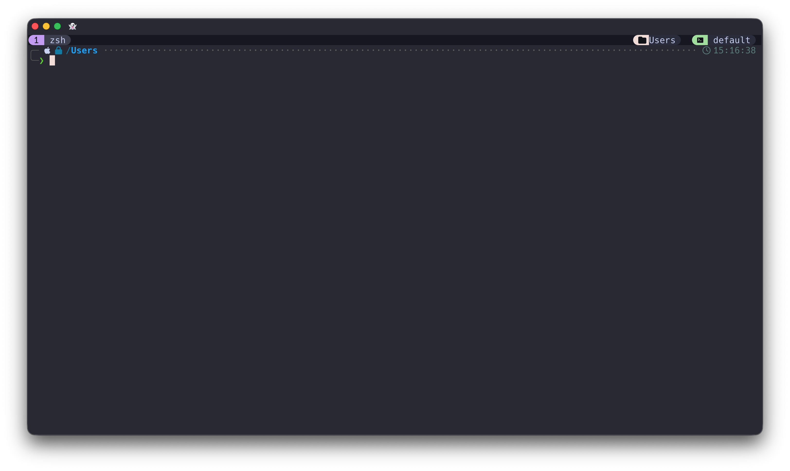
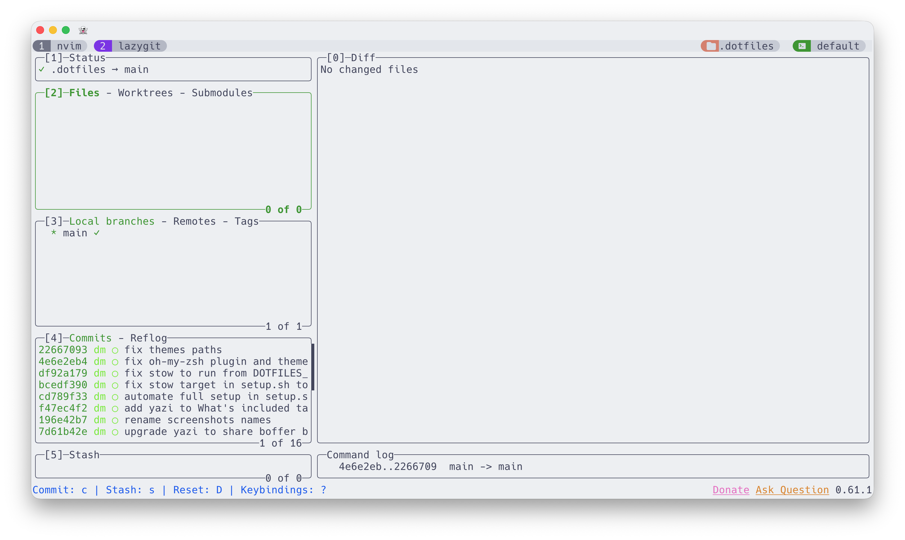

# dotfiles

Personal macOS dotfiles managed with [GNU Stow](https://www.gnu.org/software/stow/).

<table>
  <tr>
    <td></td>
    <td></td>
  </tr>
  <tr>
    <td align="center">Light mode (Catppuccin Latte)</td>
    <td align="center">Dark mode (Catppuccin Mocha)</td>
  </tr>
</table>

<table>
  <tr>
    <td></td>
    <td></td>
  </tr>
  <tr>
    <td align="center">Neovim with LazyVim</td>
    <td align="center">Lazygit</td>
  </tr>
</table>


## What's included

| Package | Config location | Description |
|---|---|---|
| `tmux` | `~/.config/tmux` | Tmux with Catppuccin theme, auto dark/light switching |
| `nvim` | `~/.config/nvim` | Neovim (LazyVim-based) with Catppuccin theme |
| `ghostty` | `~/.config/ghostty` | Ghostty terminal config + Oh My Zsh |
| `yazi` | `~/.config/yazi` | Yazi file manager config |
| `thefuck` | `~/.config/thefuck` | Thefuck settings |
| `zsh` | `~/.zshrc`, `~/.zshenv`, `~/.zprofile` | Zsh config |
| `p10k` | `~/.p10k.zsh` | Powerlevel10k prompt config |
| `idea` | `~/.ideavimrc` | IdeaVim config for JetBrains IDEs |

---

## Setup

### 1. Install Homebrew

```bash
/bin/bash -c "$(curl -fsSL https://raw.githubusercontent.com/Homebrew/install/HEAD/install.sh)"
```

### 2. Install Ghostty

Download and install from [ghostty.org](https://ghostty.org).

### 3. Clone and run setup

```bash
git clone https://github.com/BearClumsy/dotfiles ~/.dotfiles
bash ~/.dotfiles/setup.sh
```

`setup.sh` automatically handles everything:

- Installs all brew packages (`tmux`, `neovim`, `yazi`, `fzf`, `thefuck`, `eza`, `dark-notify`, `jq`, `bat`, `lazygit`)
- Installs Hack Nerd Font
- Creates all symlinks via stow
- Installs Oh My Zsh, Powerlevel10k, zsh-autosuggestions
- Installs TPM (Tmux Plugin Manager)

### 4. Install tmux plugins

Restart Ghostty, then inside tmux press `Ctrl+A` → `I`

### 5. Set up private config (optional)

Create a file for secrets and personal environment variables that won't be committed to git:

```bash
touch ~/.dotfiles/zsh/claude_config.zsh
```

Add your keys inside:

```bash
# API Keys
export ANTHROPIC_API_KEY="sk-ant-..."

# Other env vars
export EDITOR="nvim"
```

---

## How it works

### Symlink management

[GNU Stow](https://www.gnu.org/software/stow/) creates symlinks from `~/.dotfiles/` into their expected locations. Configuration lives in `.stowrc`:

- Packages `ghostty`, `nvim`, `thefuck`, `tmux` → symlinked into `~/.config/`
- Packages `zsh`, `p10k`, `idea` → symlinked into `~/` (run via `setup.sh`)

### Tmux auto theme switching

The tmux bar automatically switches between **Catppuccin Latte** (light) and **Catppuccin Mocha** (dark) when macOS appearance changes. This is powered by `dark-notify` + `tmux-dark-notify` plugin.

### Zsh + Oh My Zsh

Oh My Zsh is only loaded when using **Ghostty** terminal (detected via `$GHOSTTY_USE_OMZ=1` env var set in Ghostty config). In any other terminal a minimal zsh config is used instead.

### Neovim

LazyVim-based config. Plugins are installed automatically on first launch via `lazy.nvim`.
